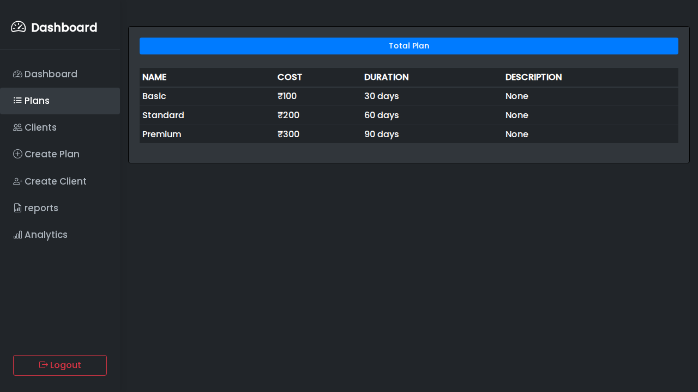
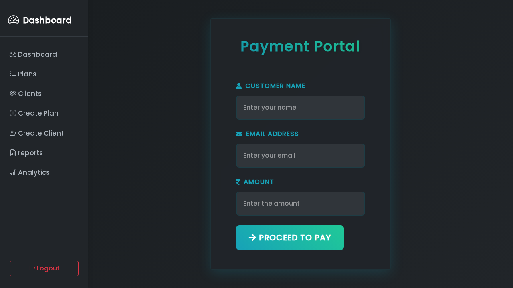
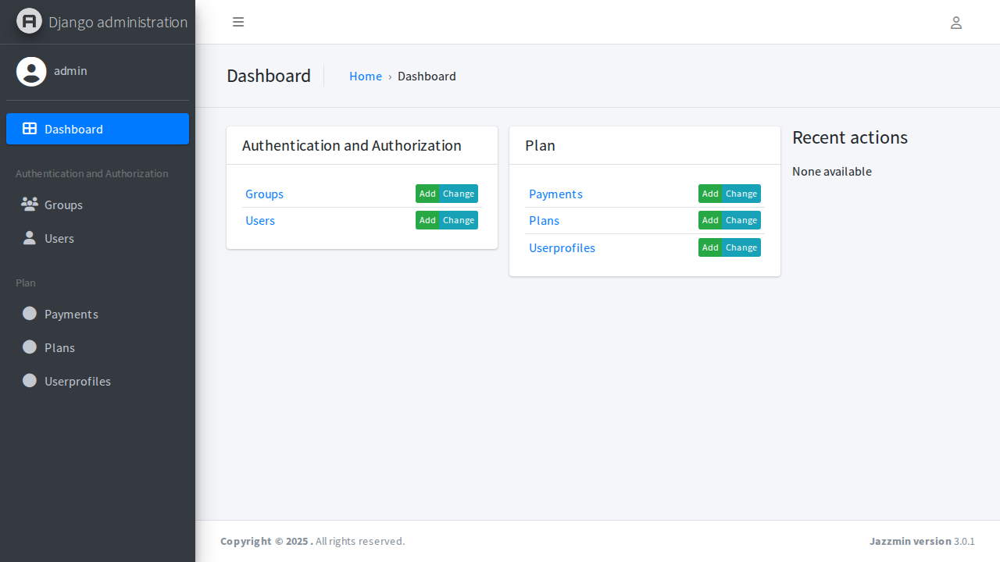

# ISP Management System

A comprehensive Django-based Internet Service Provider (ISP) management system for managing customers, plans, billing, and analytics.

## 🚀 Features

- **User Management**: Create, update, and manage customer accounts
- **Plan Management**: Configure and manage ISP service plans
- **Billing System**: Handle customer billing and payments
- **Analytics Dashboard**: Business insights and reporting
- **Admin Interface**: Beautiful admin panel with Jazzmin theme
- **Responsive Design**: Modern UI with Bootstrap 5

## 📸 Screenshots

Here are some screenshots of the application in action.

### 🔐 Authentication

**Login Interface**


### 🏠 Main Application

**Dashboard**


**Users List**


**Create User**


### 💰 Plan Management

**Plans List**


**Create Plan**


### 📊 Billing & Payments

**Billing Page**


### 📈 Analytics & Reports

**Reports Page**


**Analytics Page**


### 📧 Communication

**Email Page**


### 🔧 Administration

**Admin Panel**


## 🛠️ Technology Stack

- **Backend**: Django 4.2.20
- **Database**: SQLite3 (configurable for production)
- **Frontend**: HTML, CSS, JavaScript, Bootstrap 5
- **Admin Theme**: Jazzmin
- **Forms**: Django Crispy Forms
- **Payment Integration**: Razorpay
- **Reporting**: ReportLab for PDF generation

## 📋 Prerequisites

- Python 3.8+
- pip
- Git

## 🚀 Installation

1. **Clone the repository**
   ```bash
   git clone <your-repo-url>
   cd isp
   ```

2. **Create and activate virtual environment**
   ```bash
   python -m venv env
   # On Windows
   env\Scripts\activate
   # On macOS/Linux
   source env/bin/activate
   ```

3. **Install dependencies**
   ```bash
   pip install -r requirements.txt
   ```

4. **Run migrations**
   ```bash
   python manage.py makemigrations
   python manage.py migrate
   ```

5. **Create superuser (optional)**
   ```bash
   python manage.py createsuperuser
   ```

6. **Run the development server**
   ```bash
   python manage.py runserver
   ```

7. **Access the application**
   - Main App: http://127.0.0.1:8000/
   - Admin Panel: http://127.0.0.1:8000/admin/

## 📁 Project Structure

```
isp/
├── isp/                 # Main project settings
├── plan/               # Core application
│   ├── models.py      # Database models
│   ├── views.py       # View logic
│   ├── forms.py       # Form definitions
│   ├── urls.py        # URL routing
│   └── templates/     # HTML templates
├── static/            # Static files (CSS, JS, images)
├── templates/         # Base templates
├── manage.py          # Django management script
└── requirements.txt   # Python dependencies
```

## 🔧 Configuration

### Environment Variables
Create a `.env` file in the project root:

```env
SECRET_KEY=your-secret-key
DEBUG=True
EMAIL_HOST_USER=your-email@gmail.com
EMAIL_HOST_PASSWORD=your-app-password
```

### Database Configuration
The project uses SQLite3 by default. For production, update `settings.py`:

```python
DATABASES = {
    'default': {
        'ENGINE': 'django.db.backends.postgresql',
        'NAME': 'your_db_name',
        'USER': 'your_db_user',
        'PASSWORD': 'your_db_password',
        'HOST': 'localhost',
        'PORT': '5432',
    }
}
```

## 📱 Available Views

- **Dashboard**: Main application overview
- **Users**: Customer management
- **Plans**: Service plan configuration
- **Reports**: Business analytics and reporting
- **Analytics**: Data visualization
- **Billing**: Payment and invoice management

## 🎨 Customization

### Styling
- Modify Bootstrap variables in `static/css/`
- Update templates in `plan/templates/`
- Customize admin theme in `settings.py`

### Adding New Features
1. Create models in `plan/models.py`
2. Add views in `plan/views.py`
3. Create forms in `plan/forms.py`
4. Add URLs in `plan/urls.py`
5. Create templates in `plan/templates/`

## 🤝 Contributing

1. Fork the repository
2. Create a feature branch (`git checkout -b feature/amazing-feature`)
3. Commit your changes (`git commit -m 'Add amazing feature'`)
4. Push to the branch (`git push origin feature/amazing-feature`)
5. Open a Pull Request

## 📄 License

This project is licensed under the MIT License - see the [LICENSE](LICENSE) file for details.


