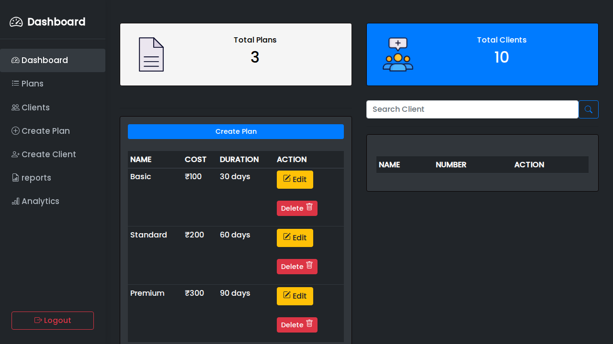
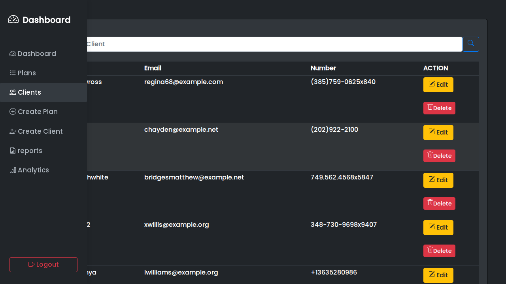
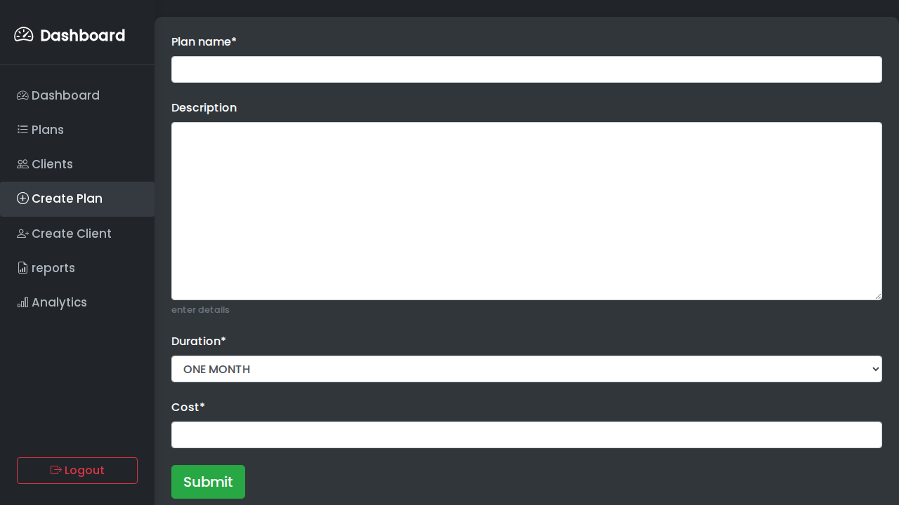
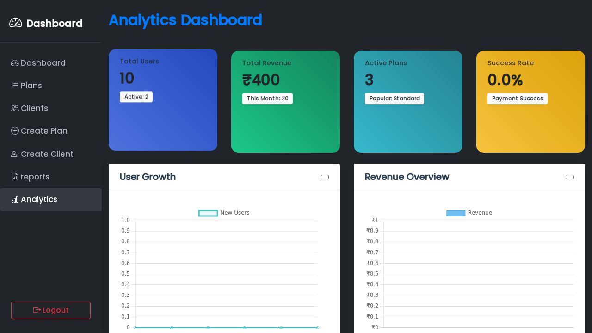

# 📸 Screenshots Guide for ISP Management System

This guide will help you capture professional screenshots of each page in your ISP Management System for the GitHub repository.

## 🎯 Pages to Screenshot

Based on your project structure, here are the main pages that need screenshots:

### 🔐 Authentication Pages
1. **Login Page** (`/login`) - User authentication interface
2. **Logout** - Confirmation or redirect page

### 🏠 Main Application Pages
3. **Dashboard** (`/`) - Main overview and navigation hub
4. **Users Management** (`/users/`) - List of all users/customers
5. **Create User** (`/createuser/`) - User registration form
6. **View User** (`/viewuser/<pk>/`) - Individual user details
7. **Update User** (`/updateuser/<pk>/`) - User editing form

### 📋 Plan Management Pages
8. **Plans** (`/plans/`) - List of ISP service plans
9. **Create Plan** (`/createplan/`) - New plan creation form
10. **Update Plan** (`/updateplan/<pk>/`) - Plan editing form
11. **Plan Clients** (`/plan_clients/`) - Customers using specific plans

### 💰 Billing & Payment Pages
12. **Billing** (`/bill/`) - Customer billing interface
13. **Payment** (`/payment/`) - Payment processing page
14. **Success** (`/success/`) - Payment confirmation page

### 📊 Analytics & Reports Pages
15. **Reports** (`/reports/`) - Business reports and analytics
16. **Analytics** (`/analytics/`) - Data visualization dashboard
17. **Generate Report** (`/generate-report/`) - Report creation interface

### 📧 Communication Pages
18. **Email** (`/email/`) - Email management interface
19. **Blank** (`/blank/`) - Generic template page

### 🔧 Admin Interface
20. **Django Admin** (`/admin/`) - Administrative panel with Jazzmin theme

## 📱 Screenshot Specifications

### Recommended Settings
- **Resolution**: 1920x1080 or 1366x768 (standard desktop)
- **Format**: PNG or JPG (PNG for better quality)
- **Browser**: Chrome, Firefox, or Edge (latest version)
- **Theme**: Light mode (better for documentation)

### Screenshot Guidelines
1. **Full Page**: Capture the entire page without browser UI
2. **Clean State**: Remove any test data or personal information
3. **Consistent Sizing**: Use the same browser window size for all screenshots
4. **Highlight Features**: Focus on key functionality and UI elements
5. **Professional Look**: Ensure the interface looks polished and complete

## 🖼️ Screenshot Organization

### Directory Structure
```
screenshots/
├── authentication/
│   ├── login.png
│   └── logout.png
├── main/
│   ├── dashboard.png
│   ├── users-list.png
│   ├── create-user.png
│   ├── view-user.png
│   └── update-user.png
├── plans/
│   ├── plans-list.png
│   ├── create-plan.png
│   ├── update-plan.png
│   └── plan-clients.png
├── billing/
│   ├── billing.png
│   ├── payment.png
│   └── success.png
├── analytics/
│   ├── reports.png
│   ├── analytics.png
│   └── generate-report.png
├── communication/
│   ├── email.png
│   └── blank.png
└── admin/
    └── admin-panel.png
```

## 📸 How to Take Screenshots

### Method 1: Browser Developer Tools
1. **Open Developer Tools** (F12)
2. **Toggle Device Toolbar** (Ctrl+Shift+M)
3. **Set Resolution** to 1920x1080 or 1366x768
4. **Take Screenshot** using browser's screenshot feature

### Method 2: Windows Snipping Tool
1. **Press Win+Shift+S**
2. **Select Area** to capture
3. **Save** as PNG in appropriate folder

### Method 3: Windows Print Screen
1. **Press PrtScn** key
2. **Paste** in Paint or other image editor
3. **Crop and Save** as PNG

### Method 4: Third-Party Tools
- **Greenshot** (Free, Windows)
- **ShareX** (Free, Windows)
- **Lightshot** (Free, Cross-platform)

## 🎨 Screenshot Enhancement Tips

### Before Taking Screenshots
1. **Clear Browser Cache** for fresh appearance
2. **Use Sample Data** that looks professional
3. **Remove Personal Info** from forms and displays
4. **Test Responsiveness** on different screen sizes

### After Taking Screenshots
1. **Crop Edges** to remove unnecessary browser elements
2. **Resize** to consistent dimensions if needed
3. **Optimize** file size (keep under 500KB each)
4. **Rename** files descriptively

## 📝 Screenshot Descriptions

### Example Descriptions for README
```markdown
### Dashboard

*Main application dashboard showing key metrics and navigation*

### User Management

*Comprehensive user management interface with search and filtering*

### Plan Creation

*Intuitive form for creating new ISP service plans*

### Analytics Dashboard

*Data visualization and business intelligence dashboard*
```

## 🚀 Implementation Steps

### Step 1: Create Screenshots Directory
```bash
mkdir screenshots
mkdir screenshots/authentication
mkdir screenshots/main
mkdir screenshots/plans
mkdir screenshots/billing
mkdir screenshots/analytics
mkdir screenshots/communication
mkdir screenshots/admin
```

### Step 2: Take Screenshots
1. **Start your Django server**: `python manage.py runserver`
2. **Navigate to each page** systematically
3. **Take screenshots** following the guidelines above
4. **Save files** in appropriate directories

### Step 3: Update README
1. **Add screenshot sections** to README.md
2. **Include descriptions** for each screenshot
3. **Organize by category** (authentication, main, plans, etc.)

### Step 4: Commit to GitHub
```bash
git add screenshots/
git commit -m "Add comprehensive screenshots for all pages"
git push origin main
```

## 🔍 Quality Checklist

Before committing screenshots, ensure:
- [ ] All main pages are captured
- [ ] Screenshots are clear and professional
- [ ] File sizes are reasonable (<500KB each)
- [ ] No personal/sensitive information is visible
- [ ] Screenshots are properly organized
- [ ] README is updated with screenshot references

## 💡 Pro Tips

1. **Consistent Timing**: Take screenshots when the application is fully loaded
2. **Error States**: Consider capturing error messages and validation states
3. **Mobile Views**: If responsive, capture mobile versions too
4. **Loading States**: Show loading animations if they exist
5. **Interactive Elements**: Capture hover states and dropdowns

---

**Happy Screenshotting! 📸✨** 